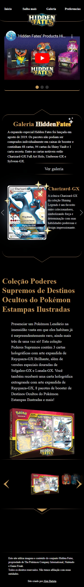
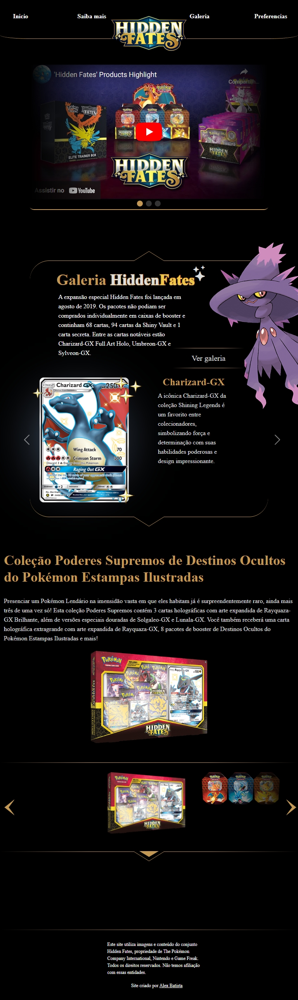
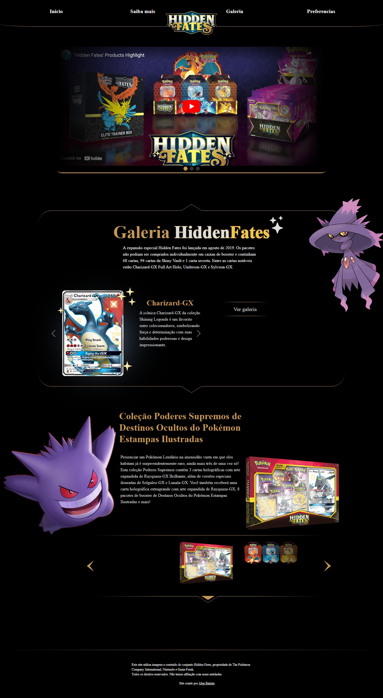

<h1 align="center">
    TCG - Hidden Fates - ReactJs
</h1>

<h4 align="center"><a href="https://hiddenfates-wiki.netlify.app">Clique para acessar o projeto</a></h4>

   Olá sejam bem-vindos. TCG-Hidden Fates é um projeto desenvolvido no ReactJs, com base no set "Hidden Fates" do jogo de cartas Pokemon. 

Tecnologias utilizadas:

Para o desenvolvimento deste site utilizei as seguintes tecnologias:

- ReactJs;
- Bibliotecas React: React-Route, Fuse, SwiperJs, Bootstrap entre outras...
- API: <a href="https://tcgdex.dev">TCGDex</a>
- Sass;
---

Imagens:

    
    
    

